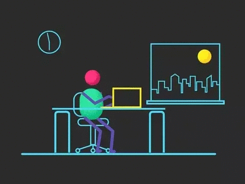

-Flutter-gold.svg)

<h1> 
 ❤️ Hello Developers ❤️ 
  
  

### 
  💡 _Now I am Going to Present You My New and First Flutter Application_ 💡 
</h1>
 

 &nbsp&nbsp
 &nbsp&nbsp
 &nbsp&nbsp  
 &nbsp&nbsp
 &nbsp&nbsp

###  
😲 _This is Mr. Promodoro App Made in Flutter_ 😲

***
 

### ✨ Update on 18/04/2022

#### Introducing Clean Look with Modern View and Text Fonts and Size Improved.

 

### ✨ Update on 17/10/2021

#### Some Animation is removed after migrating to null safety due to some packages not migrated to null safety

## 	✨ Important Links:-

#### [🎯 Read about the Pomodoro Technique From Here](https://en.wikipedia.org/wiki/Pomodoro_Technique)

## 	✨ Third Party Packages Used Here:-
#### [🎯 Animated Splash Screen](https://pub.dev/packages/animated_splash_screen)
#### [🎯 SqfLite](https://pub.dev/packages/sqflite)
#### [🎯 Path Provider](https://pub.dev/packages/path_provider)
#### [🎯 Circular Countdown Timer](https://pub.dev/packages/circular_countdown_timer)
#### [🎯 rflutter_alert](https://pub.dev/packages/rflutter_alert)
#### [🎯 wakelock](https://pub.dev/packages/wakelock)
#### [🎯 url_launcher](https://pub.dev/packages/url_launcher)

***

#### 
🎯 Check [CONTRIBUTING.md](https://github.com/SamarpanCoder2002/Mr-Pomodoro/blob/main/CONTRIBUTING.md) file before contribution

<h3 align="center">Show 💘 by Starring This Repo</h3>

- #### [Click Here to See the Project Video](https://youtu.be/nCxB039zXOY)

- #### [Follow Me on LinkedIn to Get Regular Project Updates](https://www.linkedin.com/in/samarpan-dasgupta-4aa1061b0/ "LCO")

<h3 align="center"><b>🧡 Thank You For Visiting 🙏, Have a Nice Day 🧡</b></h3>