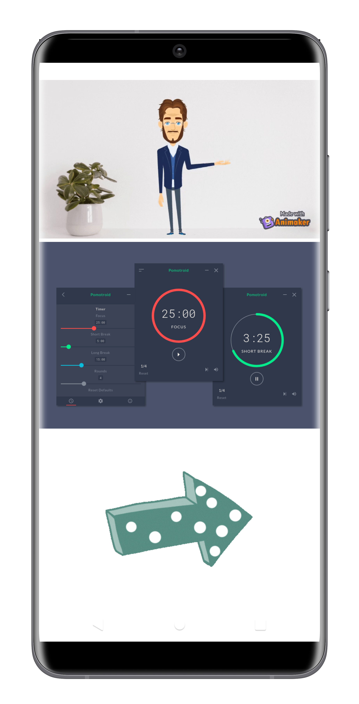
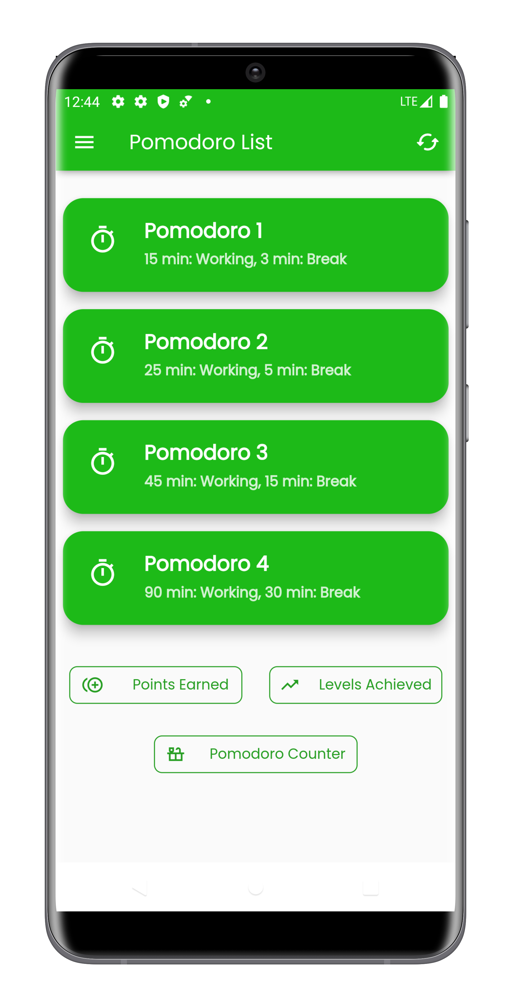
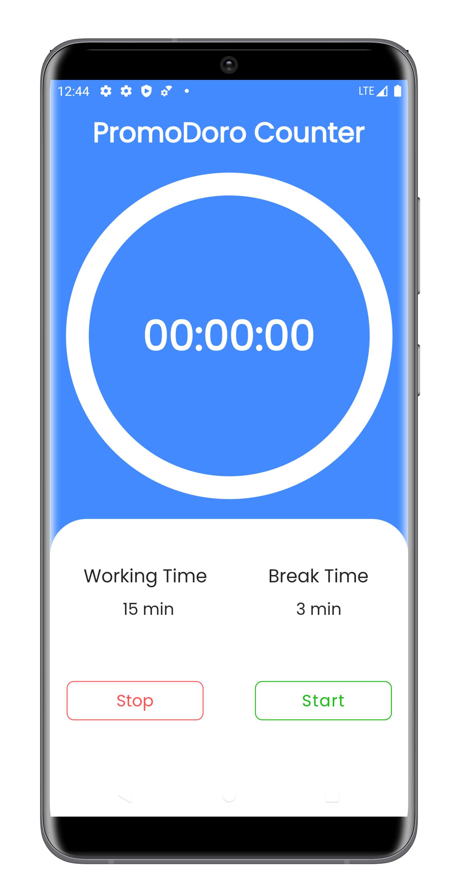

-Flutter-gold.svg)

<h1> 
 ❤️ Hello Developers ❤️ 

### 
  💡 _Now I am going to present you My New and First Flutter Application_ 💡 
</h1>
 

 &nbsp&nbsp
 &nbsp&nbsp
 &nbsp&nbsp 
 &nbsp&nbsp
 &nbsp&nbsp

###  
😲 _This is Mr. Promodoro App made by Flutter_ 😲

### Important Links:-

### [Read about the Pomodoro Technique From Here](https://en.wikipedia.org/wiki/Pomodoro_Technique)
### [Download This App From Here](https://drive.google.com/file/d/16bR83d1arDhaURobsWal2UruwkebGtsI/view?usp=sharing)

***

### Third Party Packages Used Here:-
### [Animated Splash Screen](https://pub.dev/packages/animated_splash_screen)
### [SqfLite](https://pub.dev/packages/sqflite)
### [Path Provider](https://pub.dev/packages/path_provider)
### [Circular Countdown Timer](https://pub.dev/packages/circular_countdown_timer)
### [rflutter_alert](https://pub.dev/packages/rflutter_alert)
### [countup](https://pub.dev/packages/countup)
### [wakelock](https://pub.dev/packages/wakelock)
### [url_launcher](https://pub.dev/packages/url_launcher)

***

<h3 align="center">Show 🧡 by Starring This Repo</h3>

- ### [Click Here to See the Project Video](https://www.youtube.com/channel/UCafv0dsb4Xp8sSWoKdmw5BQ)

- ### [Follow Me on LinkedIn to Get Regular Project Updates](https://www.linkedin.com/in/samarpan-dasgupta-4aa1061b0/ "LCO")

<h3 align="center"><b>🧡 Thank You For Visiting 🙏, Have a Nice Day 🧡</b></h3>

***

## Guidelines

- [Lab: Write your first Flutter app](https://flutter.dev/docs/get-started/codelab)
- [Cookbook: Useful Flutter samples](https://flutter.dev/docs/cookbook)

For help getting started with Flutter, view our
[online documentation](https://flutter.dev/docs), which offers tutorials,
samples, guidance on mobile development, and a full API reference.
